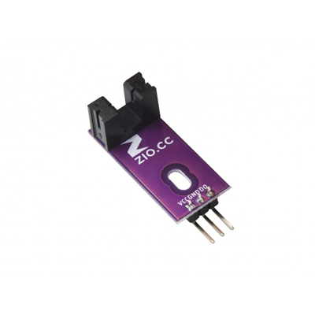

# Zio-Rotary-Encoder-Sensor

> This product can be available for purchase [here](https://www.smart-prototyping.com/Zio-Rotary-Encoder-SensorC).

#### Description

This is a U-Shaped infrared sensor that can be used to detect the rotational speed of a motor mounted on a robot. This reading can be used to adjust the motor speed if it is too fast or too slow, and to calculate the robot’s real-world travel speed. Using a pair of these sensors, we can also measure the robot’s rotation, enabling navigation based on dead-reckoning methods.

#### Specification

* U-Shaped Sensor Gap: 5mm
* Output Signal Explaination: when the IR beam is unobstructed (not blocked by the encoder disc) it outputs a logic-LOW level(0); when blocked it outputs HIGH Level(1).
* IR Signal Trigger: SN74LVC1G14 Single Schmitt-Trigger Inverter
* Dimension: 32x 14mm
* Weight: 1.9g

#### Links

* [Eagle file](https://github.com/ZIOCC/Zio-Rotary-Encoder-Sensor/)
* [How IR Sensor Works](https://www.digikey.com/en/articles/techzone/2012/feb/using-infrared-technology-for-sensing)
* [SN74LVC1G14 Datasheet](http://www.ti.com/lit/ds/symlink/sn74lvc1g14.pdf)

> ###### About Zio
> Zio is a new line of open sourced, compact, and grid layout boards, fully integrated for Arduino and Qwiic ecosystem. Designed ideally for wearables, robotics, small-space limitations or other on the go projects. Check out other awesome Zio products [here](https://www.smart-prototyping.com/Zio).

